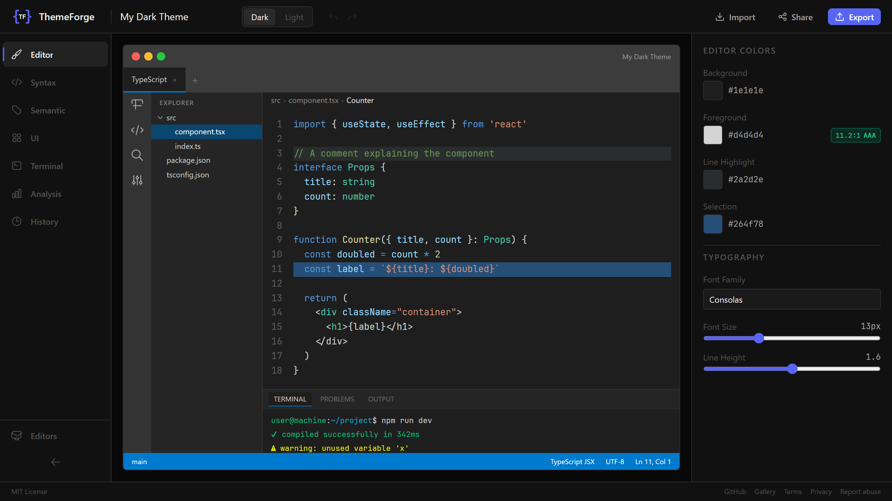

# ThemeForge

> Open source code editor theme builder — design, preview, and export themes directly in your browser.

**[Try it ](https://themeforge.app)** · **[Gallery](https://themeforge.app/gallery)** · **[Contributing](CONTRIBUTING.md)**

---



---

ThemeForge is a fully client-side theme editor for code editors. Pick colors with an HSV picker, see live syntax highlighting update in real time, check WCAG contrast compliance, and export a ready-to-install `.vsix` file — all without signing up or sending your data anywhere.

---

## Features

### Editor

- **Visual color editor** — HSV picker with 2D palette, hue slider, hex input, and 36 presets
- **Live preview** — editor chrome mockup with syntax highlighting, file explorer, breadcrumbs, status bar, terminal
- **Multi-language tabs** — JS/TS and Python previews; drag to reorder, open/close freely
- **File explorer** — click files to switch code view; collapse folders with animated chevron
- **Undo / Redo** — Ctrl+Z / Ctrl+Y with a full git-style history panel (up to 50 snapshots)
- **Dark / Light themes** — switch with confirmation to avoid accidental data loss

### Color Analysis

- **WCAG 2.1 contrast checker** — AA/AAA compliance badges on every color
- **Color harmony scoring** — complementary, analogous, triadic analysis
- **Readability score** — checks 7 key token/background pairs

### Import & Export

- **Import** — load an existing `.vsix` or `theme.json` file
- **Export to .vsix** — one-click install for VS Code and Cursor (client-side JSZip, no server round-trip)
- **Includes** `tokenColors` and `semanticTokenColors`

### Sharing

- **Share themes** — generate a permanent link (e.g. `/theme/V1StGXR8_Z`)
- **View-only mode** — shared links open read-only with an "Edit a copy" button
- **Gallery** — browse community themes; optionally make yours public when sharing

---

## Getting Started

### Prerequisites

- Node.js >= 20
- npm >= 10

### Install

```bash
git clone https://github.com/erenisci/themeforge
cd themeforge
npm install
cd packages/shared && npm run build && cd ../..
```

### Run

```bash
# Copy env files
cp packages/backend/.env.example packages/backend/.env
cp packages/frontend/.env.local.example packages/frontend/.env.local

# Start both (Turborepo)
npm run dev
```

Or individually:

```bash
npm run dev:backend    # Express on :3001
npm run dev:frontend   # Next.js on :3000
```

Open [http://localhost:3000/editor](http://localhost:3000/editor).

---

## Environment Variables

**Backend** (`packages/backend/.env`):

```bash
NODE_ENV=development
PORT=3001
CORS_ORIGIN=http://localhost:3000
FRONTEND_URL=http://localhost:3000
TURSO_DATABASE_URL=file:./data/themes.db   # local SQLite for dev; use Turso URL in prod
TURSO_AUTH_TOKEN=                           # leave empty for local dev
```

**Frontend** (`packages/frontend/.env.local`):

```bash
NEXT_PUBLIC_API_URL=http://localhost:3001
```

---

## Project Structure

```
themeforge/
├── packages/
│   ├── shared/          # TypeScript types + WCAG/harmony/readability algorithms
│   ├── backend/         # Express + Turso (libSQL) — theme sharing API
│   └── frontend/        # Next.js 14 — editor UI
├── vercel.json          # Vercel deploy config
├── turbo.json
└── package.json
```

### Backend API

| Method | Path                  | Description                      |
| ------ | --------------------- | -------------------------------- |
| `POST` | `/api/themes/share`   | Save a theme, get a shareable ID |
| `GET`  | `/api/themes/:id`     | Fetch a shared theme by ID       |
| `GET`  | `/api/themes/gallery` | List public themes (paginated)   |
| `GET`  | `/health`             | Health check                     |

### Frontend Routes

| Route            | Description                                       |
| ---------------- | ------------------------------------------------- |
| `/editor`        | Main editor — loads default dark theme            |
| `/theme/:id`     | View-only shared theme — "Edit a copy" to fork it |
| `/gallery`       | Community theme browser                           |
| `/legal/terms`   | Terms of Service                                  |
| `/legal/privacy` | Privacy Policy                                    |

---

## How Sharing Works

1. Click **Share** in the toolbar
2. Optionally enter your name and check **Add to public gallery**
3. Click **Generate Link** — a permanent URL is created
4. Anyone opening that link sees it in **view-only** mode
5. They click **Edit a copy** to fork it into the editor — a new ID is generated each time

---

## How Export Works

Click **Export** → choose your editor (VS Code, Cursor, or others as they're added). The file is built client-side using JSZip — no server involved. Includes both `tokenColors` and `semanticTokenColors`.

To install in VS Code / Cursor:

- Drag the `.vsix` into the Extensions panel, **or**
- Run `Extensions: Install from VSIX` from the command palette

---

## Algorithms

All color analysis runs entirely in the browser — no AI, no external API.

**WCAG 2.1** (`packages/shared/src/algorithms/wcag.ts`):

```
relativeLuminance = 0.2126R + 0.7152G + 0.0722B  (after gamma correction)
contrastRatio = (L1 + 0.05) / (L2 + 0.05)
AAA ≥ 7:1 · AA ≥ 4.5:1 · fail < 4.5:1
```

**Harmony** (`packages/shared/src/algorithms/harmony.ts`): scores complementary (~180°), analogous (≤30°), and triadic (~120°) hue relationships.

**Readability** (`packages/shared/src/algorithms/readability.ts`): checks 7 key token/background pairs and returns a percentage score.

---

## Tech Stack

| Layer    | Technology                                                            |
| -------- | --------------------------------------------------------------------- |
| Frontend | Next.js 14, TypeScript, Tailwind CSS, Zustand, @dnd-kit, lucide-react |
| Backend  | Express, TypeScript, @libsql/client (Turso)                           |
| Shared   | tsup, zod, nanoid                                                     |
| Export   | JSZip (client-side)                                                   |
| Monorepo | Turborepo, npm workspaces                                             |

---

## Contributing

Pull requests are welcome. See [CONTRIBUTING.md](CONTRIBUTING.md) for how to add new language previews and editor exports.

For bugs or feature requests, [open an issue](https://github.com/erenisci/themeforge/issues).

---

## License

MIT © [erenisci](https://github.com/erenisci) — see [LICENSE](LICENSE) for details.
